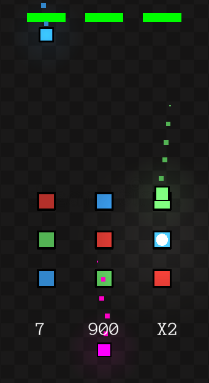
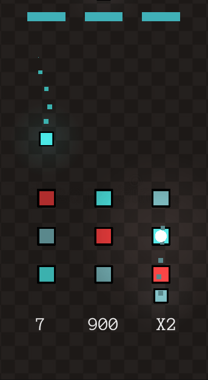
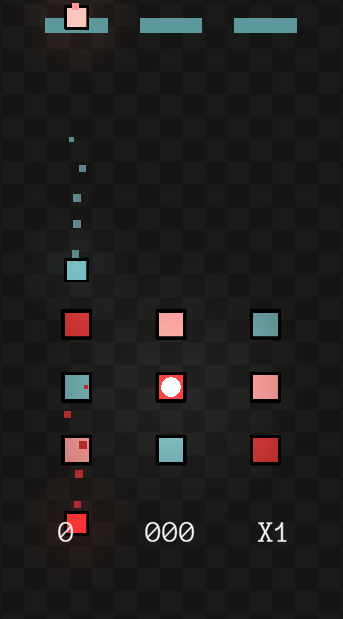

# Package d'accessibilité - Daltonisme

### Qu’est-ce que c’est ?
Ce package contient un outil permettant de voir à travers les yeux d’une personne atteinte de daltonisme. Ces filtres facilement applicables vous donneront une idée des modifications à apporter à vos projets, afin de les rendre plus accessibles.

### Comment ça fonctionne ?
Ce package est à utiliser avec l’Universal Render Pipeline (URP) disponible à travers le package manager. Celui-ci propose l’utilisation d’un post-processing volume, qui permet d’influencer visuellement le rendu d’une scène. L’utilisation de sa composante « Channel Mixer » permet de changer une couleur donnée par une autre. C’est ce procédé qui est utilisé afin de traiter 7 types de daltonismes.  

L'image de gauche représente le jeu dans son état normal.  
L'image au centre montre le jeu lorsque le filtre "Tritanopie" est appliqué. Elle démontre que les personnes atteintes de tritanopie peuvent éprouver certaines difficultés à différencier certaines cases de couleurs.   
L'image de droite est une capture, sous le filtre tritanopie, une fois des changements appliqués. Ces changements permettent l'inclusion des personnes atteintes de cette forme de daltonisme. 

<table align="center">
	<tr>
		<td></td>
		<td></td>
		<td></td>
	</tr>
</table>

### Comment l’intégrer ? 
//Ajouter méthode d’intégration
